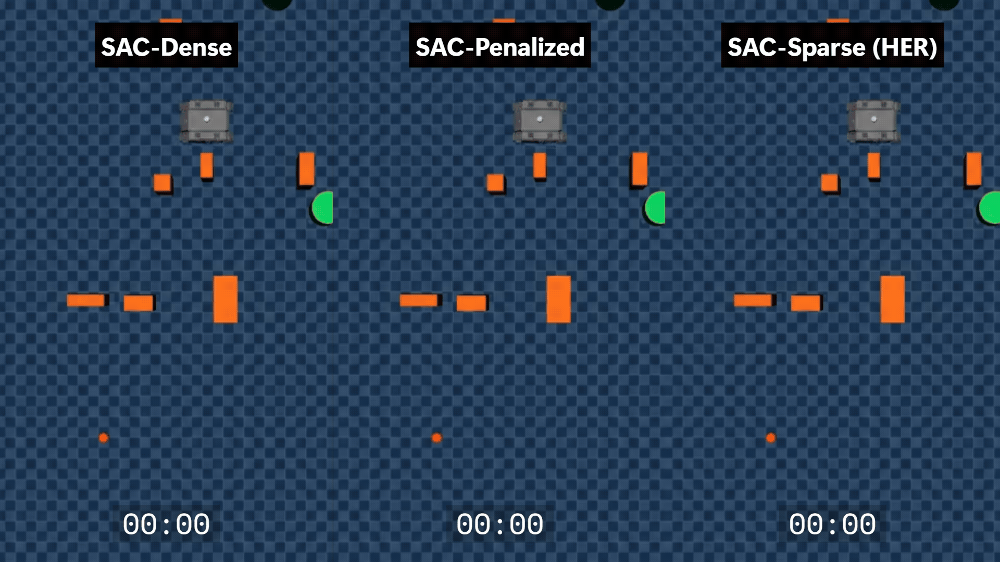

# MuJoCo RL Mobile Robot Navigation 

<p align="center">
  
</p>

This repository provides an implementation of mapless navigation for Skid-Steer Mobile Robots (SSMRs) using Soft Actor-Critic (SAC) and Hindsight Experience Replay (HER). This framework focuses on dynamical feasibility and control smoothness, proving that sparse rewards can act as an implicit regularizer to eliminate steering oscillations and robust navigation.

## Install

**Requires Python 3.10 and Linux.** We recommend using a Conda environment, but any virtual environment will work.

### 0. Install Conda (if you haven't already)

Follow the instructions in the [official Conda documentation](https://docs.conda.io/projects/conda/en/stable/user-guide/install/linux.html) to install Miniconda.

### 1. Create the Conda Environment

```bash
conda create -n "rl_nav" python=3.10.12 ipython
```

### 2. Activate the Environment

```bash
conda activate rl_nav
conda env config vars set PYTHONNOUSERSITE=1  # Prevents user-site packages from leaking into the environment
```

### 3. Install PyTorch

The command below assumes an **NVIDIA GPU with CUDA 12.4**. Check your version with `nvidia-smi` and visit [pytorch.org](https://pytorch.org/get-started/locally/) if you need a different CUDA version or CPU-only install.

```bash
pip install torch==2.6.0 torchvision==0.21.0 torchaudio==2.6.0 --index-url https://download.pytorch.org/whl/cu124
```

### 4. Install Additional Requirements

```bash
pip install -r requirements.txt
```

### 5. Verify Installation

```bash
python -c "import mujoco; import torch; print('CUDA available:', torch.cuda.is_available())"
```

## Repository Structure

All variant folders share the same internal structure but implement different approaches regarding reward formation, observation space, and training algorithms.

### Architectural Variants

*   **`SAC_Dense/`** (SAC-Dense):
    *   **Reward**: Dense (progress-based).
    *   **Observation**: Memoryless ($s_t = [\mathcal{L}_t, \mathcal{G}_t, \mathcal{V}_t]$).
    *   **Description**: Uses Soft Actor-Critic with explicit relative goal information.

*   **`SAC_Dense_Hist/`** (SAC-Dense + Hist):
    *   **Reward**: Dense.
    *   **Observation**: History-augmented ($s_t = [\mathcal{L}_t, \mathcal{G}_t, \mathcal{H}_t]$).
    *   **Description**: Incorporates a temporal buffer of past velocity commands ($\mathcal{H}_t$) to capture short-term motion patterns.

*   **`SAC_Sparse_HER/`** (SAC-Sparse (HER)):
    *   **Reward**: Sparse (goal-conditioned).
    *   **Observation**: Memoryless ($s_t = [\mathcal{L}_t, \mathcal{G}_t, \mathcal{V}_t]$).
    *   **Description**: Uses Hindsight Experience Replay (HER) to learn from sparse rewards. Relative goal features are recomputed internally to support goal relabeling.

*   **`SAC_Sparse_HER_Hist/`** (SAC-Sparse (HER) + Hist):
    *   **Reward**: Sparse.
    *   **Observation**: History-augmented ($s_t = [\mathcal{L}_t, \mathcal{G}_t, \mathcal{H}_t]$).
    *   **Description**: Combines HER with velocity history to handle both sparse rewards and partial observability/temporal context.

*   **`SAC_Penalized/`** (SAC-Penalized):
    *   **Reward**: Dense with angular-acceleration penalty.
    *   **Observation**: Memoryless ($s_t = [\mathcal{L}_t, \mathcal{G}_t, \mathcal{V}_t]$).
    *   **Description**: Uses explicit motion cost penalties to encourage smoother control outputs.

### Assets

*   **`assets/worlds/`**: Contains the procedural simulation environments.
    *   Divided into **train**, **valid**, and **test** sets.
    *   Each set contains MuJoCo XML files generated with varying obstacle densities (**easy**, **medium**, **hard**).
    *   Includes the generator scripts used to create these reproducible environments via deterministic seeding.

## Feature Extraction & Approach

The project explores the impact of reward density, goal conditioning, and temporal context.
*   **Shared Backbone**: All variants use a consistent spatial perception backbone (PointNet-style encoder for LiDAR) and action space.
*   **Modular Design**: Feature extractors are designed to handle heterogeneous observations (spatial, goal, temporal) and fuse them into a unified latent representation.

## Experimental Setup

*   **Simulation**: MuJoCo.
*   **Robot**: AgileX Bunker skid-steer platform.
*   **Task**: Navigate to a goal within a predefined tolerance while avoiding collisions.
*   **Evaluation**: Models are evaluated on unseen test worlds using metrics such as Success weighted by Path Length (SPL), Control Smoothness, and Mean Clearance Distance.

## Inference & Results

Each variant folder (`SAC_Dense`, `SAC_Dense_Hist`, `SAC_Sparse_HER`, `SAC_Sparse_HER_Hist`, `SAC_Penalized`) contains a `sac_inference.py` script and a `inference_results/` directory where the evaluation metrics and logs are saved.

### Running Inference

To run an inference example (e.g., for the `SAC_Sparse_HER` variant), navigate to the variant's directory and execute the inference script:

```bash
cd SAC_Sparse_HER
python3 sac_inference.py
```

This will load the default trained model, run evaluation episodes on the configured test worlds, and save the detailed metrics to `SAC_Sparse_HER/inference_results/`.

## 📄 Citation
If you find this work useful, please consider citing our paper:
> **Paper coming soon** — BibTeX entry will be added upon publication.
